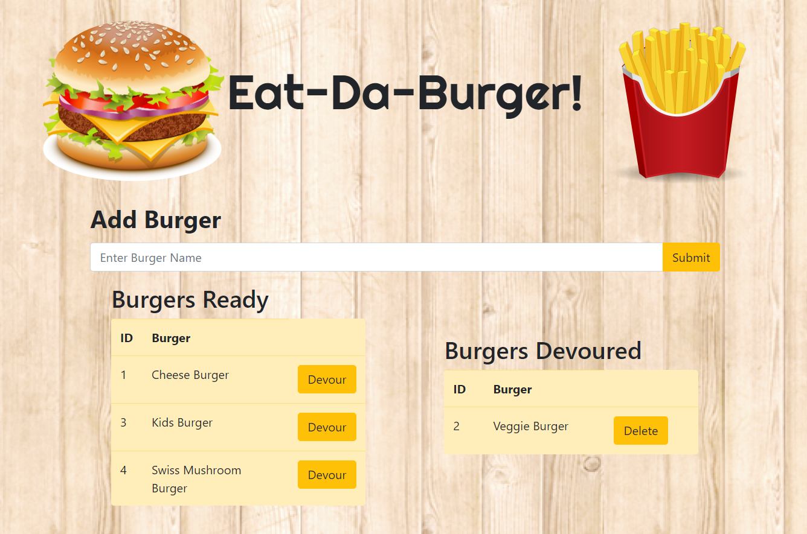

# Burger
A burger logger with MySQL, Node, Express, Handlebars and a ORM.

### Table of Contents
* General Info
* Deployed Link
* Files/Folder Structure
* Technologies

### General Info
This is a burger logger application that lets the user:
- Add a new burger by entering the burger name and clicking on the "submit" button.
- Devour burgers by clicking on "Devour" buttons for each burger.
- Delete burgers by clicking on "Delete" button for each burger.

### Deployed Link
[Click here to use the Eat-Da-Burger app](https://secret-temple-22638.herokuapp.com/)

### Files/Folder Structure
config
> `connection.js` 
>-`orm.js`

controllers 
>`burgerController.js`

db
 >`schema.sql` 
 >`seeds.sql`
 
models
>`burger.js`

public
>assets
>>css
>>>`style.css`

>>images
>>>`burger.png` 
>>>`Eat-Da-Burger.png` 
>>>`fries.png` 
>>>`tileable_wood_texture_@2X.png`

>>js
>>>`burgers.js`

views
>layouts
>>`main.handlebars`

>partials
>>burgers
>>>`burger-block.handlebars`

>`index.handlebars`

`package-lock.json` 
`package.json` 
`README.md` 
`server.js` 

### Technologies
#### Project is created with:
* JavaScript
* jQuery
* Node.js
* Express
* MySQL
* Handlebars
* ORM

#### Packages used:
* express
* express-handlebars
* mysql